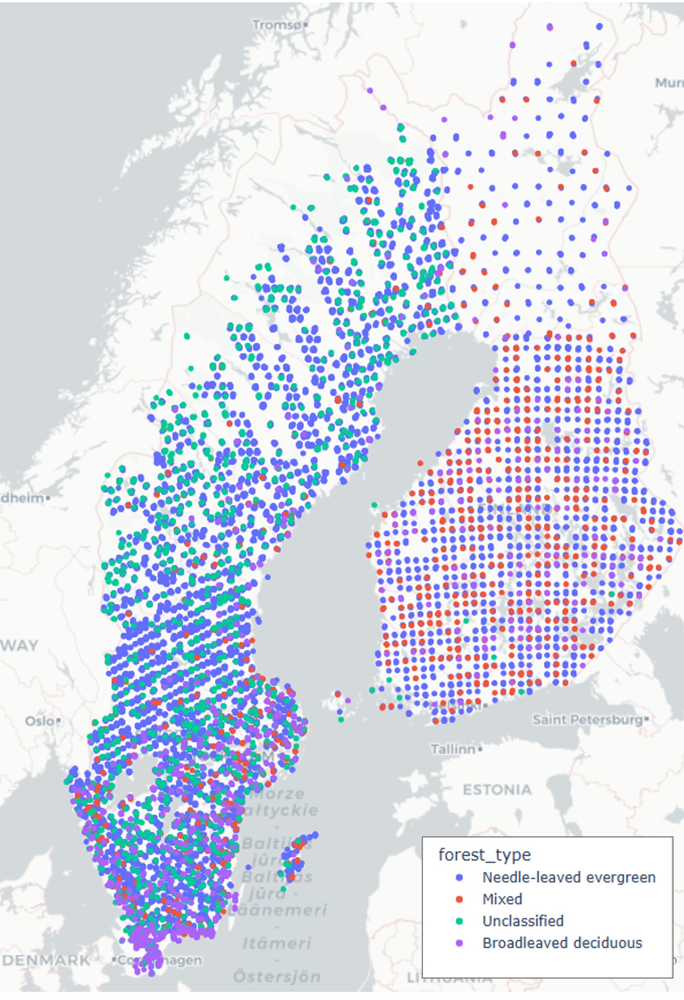

# forest-classification-pipeline
# Forest Classification Pipeline

Welcome to the *Forest Classification Pipeline*, developed as part of my MSc Computer Science dissertation at the University of Exeter. This repository supports research into classifying boreal forest types in Finland and Sweden by combining National Forest Inventory (NFI) ground-survey data with satellite imagery from Sentinel-1 and Sentinel-2.  

The aim of the project is to build a scalable, reproducible, and open-source workflow for classifying and monitoring forest types at a landscape scale. 
The pipeline focuses on overcoming typical challenges in boreal satellite-based classification, including heavy cloud cover, noisy radar data, mixed-pixel effects, and the integration of time-series data across multiple seasons.  

## Background and Motivation

Climate change is driving shifts in the distribution and resilience of European forests, with potentially significant consequences for carbon storage, biodiversity, and the timber industry. Species such as spruce and pine may lose large parts of their range, being replaced by more drought-tolerant broadleaved species. 
Pine trees are generally better at carbon sequestration as well as more profitable, these changes could have an enormous economic impact on europe as well as an ecological one.
Accurate, frequent monitoring of these changes is essential to inform management and policy decisions.

While ground-based surveys offer high accuracy, they are expensive and limited in scale. Remote sensing, especially with the free and frequent imagery from Sentinel satellites, provides a promising alternative — but faces problems with cloud interference and mixed-pixel contamination. This project explores how time-series classification methods, combined with spatial clustering and careful feature engineering of SAR data, can help overcome these issues.  

## Map of Plot Distribution




## Overview of This Repository

This repository contains updates from the pipeline I am developing, organised into the following areas:

- **src/**  
  Will contain the main project code, including:
  - scripts for clustering forest plots by dominant forest type using DBSCAN  
  - tools to prepare time-series data for machine learning  
  - experiments with classification models including Random Forests, Canonical Interval Forest, RNNs, and LSTMs  
  - my config for PlotToSat to merge ground-survey data with extracted satellite features from Google Earth Engine

- **scripts/**  
  A set of supporting scripts to help with:
  - preparing CSVs for PlotToSat and other tools  
  - checking and tracking chunk-based Google Earth Engine exports  
  - performing quality checks on shapefiles  
  - renaming and organising large folders of satellite data

- **data/** (optional)  
  This folder can contain a *small*, anonymised sample dataset to demonstrate the code structure, but not the full NFI data, which is subject to licensing.

## Features

Some of the key features of the pipeline include:  

- grouping forest plots into dominant forest-type clusters, with different thresholds, reducing noise from small, mixed pixels  
- time-series feature extraction and engineering  
- robust handling of Sentinel-1 SAR data, which can operate through cloud cover  
- an optional combination with Sentinel-2 data, when cloud-free observations are available  
- tools for managing and checking batch downloads from Google Earth Engine, to ensure no plots are missing  
- experiments with modern time-series classifiers, including neural networks  
- a reproducible structure that could be extended for other countries or forest inventory datasets

## Technology Stack

The pipeline is implemented in Python and relies on the following packages:

- pandas, numpy, scikit-learn (core data processing and classical ML)  
- plotly (interactive visualisation of cluster maps)  
- geopandas, shapely (geospatial operations)  
- Google Earth Engine Python API  
- google-api-python-client (for tracking Drive exports)  

## Getting Started

To get started, clone this repository:

```bash
git clone https://github.com/YOURUSERNAME/forest-classification-pipeline.git
cd forest-classification-pipeline
```
Create a virtual environment if you wish, then install the required packages:
```bash
pip install -r requirements.txt
```
You will also need to configure your own Google Cloud OAuth credentials (credentials.json) if you wish to use the Google Drive export-checking features.

## Usage

Each script in src/ and scripts/ can be run independently. Open each file to see comments describing their purpose, input files, and output.

For example, to run the DBSCAN clustering of dominant forest types, you would use:
```bash
python src/cluster_forest_types.py
```
If you want to check for missing data chunks from Google Earth Engine exports, locally, run:

python scripts/findwhereleftoff.py

If you want to use the Google Drive API to check this without downloading your Google Earth Engine outputs (recommended), run:
```bash
python scripts/findwhereleftoff_drive_api.py
```
## Data
This repository does not include the full Finland/Sweden National Forest Inventory datasets due to licensing. Please use your own harmonised plot CSVs if you wish to reproduce the results.

Any included data samples are anonymised or purely for demonstration.

##Acknowledgements

Special thanks to the author and  maintainer of PlotToSat, Dr Milto Miltiadou, the Google Earth Engine community, and open-source contributors who make large-scale ecological monitoring possible.

References
The approach was inspired by published work in tree species classification with Sentinel data, including:

Miltiadou et al., IGARSS 2024

Immitzer et al., 2012

Ball et al., 2017

various sources listed in the dissertation (see references folder when I get round to including it!)

License
MIT License (or your choice)
